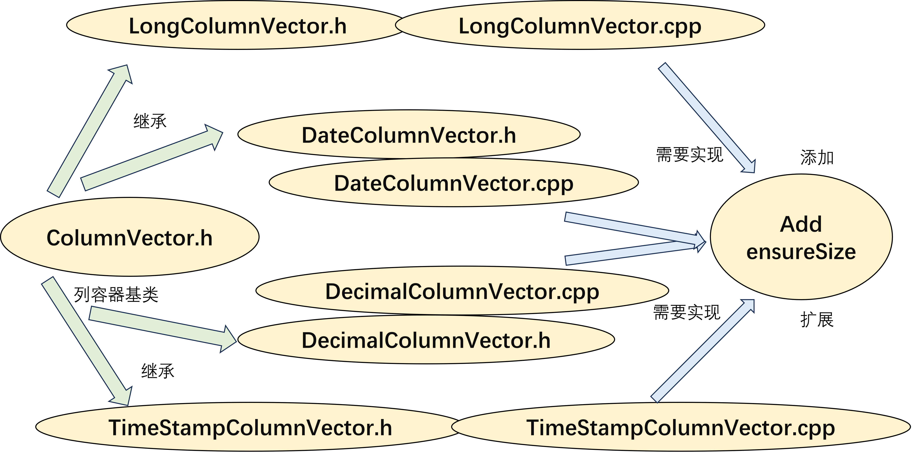

## 实用数据库开发

### 实验二 实现多种类型的CloumnWriter

#### 实验描述

本次实验同学们需要实现将.tbl转化为pixels所能读取的.pxl文件格式。

#### 实验过程

##### 任务一 add 方法实现

在父类ColumnVector中增加add虚函数定义，并在子类DateColumnVector、DecimalColumnVector、TimestampColumnVector 中实现 add 方法和 ensureSize 辅助方法。

已经实现好的示例文件：

[LongColumnVector.cpp](./pixels-core/lib/vector/LongColumnVector.cpp)

等待实现的文件：

[DateColumnVector.cpp](./pixels-core/lib/vector/DateColumnVector.cpp)

[DecimalColumnVector.cpp](./pixels-core/lib/vector/DecimalColumnVector.cpp)

[TimestampColumnVector.cpp](./pixels-core/lib/vector/TimestampColumnVector.cpp)

**调用关系**：

    

##### 任务二 ColumnWriter 实现

实现上述几种类型的ColumnWriter,可以成功写入.tbl 文件到.pxl 文件中。以上类的头文件在源代码的cpp/pixels-core/include/writer/ 目录下，源文件在源代码的cpp/pixels-core/lib/writer/ 目录下。

已经实现好的示例文件：

[IntegerColumnWriter.cpp](./pixels-core/lib/writer/IntegerColumnWriter.cpp)

等待实现的文件：

[LongDecimalColumnWriter.cpp](./pixels-core/lib/writer/LongDecimalColumnWriter.cpp)

[DateColumnWriter.cpp](./pixels-core/lib/writer/DateColumnWriter.cpp)

[DecimalColumnWriter.cpp](./pixels-core/lib/writer/DecimalColumnWriter.cpp)

[TimestampColumnWriter.cpp](./pixels-core/lib/writer/TimestampColumnWriter.cpp)

 任务三
实现写入文件可以被duckdb通过pixels正确读取，相关的测试文件可以参考pixels-duckdb
 /examples/pixels-example, 也可以直接运行 duckdb 进行测试, 因为编译 duckbd 时，已经将 pixels
extension 链接了进去