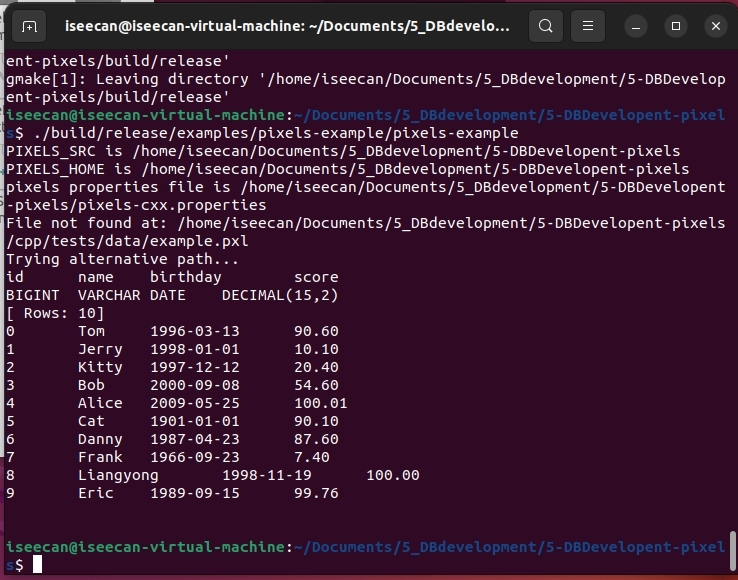
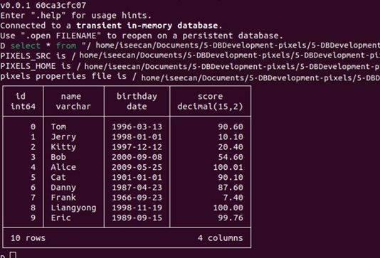

## 实用数据库开发

### 实验二 实现多种类型的CloumnWriter

#### 实验描述

本次实验同学们需要实现将.tbl转化为pixels所能读取的.pxl文件格式。

#### 实验过程

##### 任务一 add 方法实现

在父类ColumnVector中增加add虚函数定义，并在子类DateColumnVector、DecimalColumnVector、TimestampColumnVector 中实现 add 方法和 ensureSize 辅助方法。

已经实现好的示例文件：

[LongColumnVector.cpp](./pixels-core/lib/vector/LongColumnVector.cpp)

等待实现的文件：

[DateColumnVector.cpp](./pixels-core/lib/vector/DateColumnVector.cpp)

[DecimalColumnVector.cpp](./pixels-core/lib/vector/DecimalColumnVector.cpp)

[TimestampColumnVector.cpp](./pixels-core/lib/vector/TimestampColumnVector.cpp)

**调用关系**：

<div style="text-align: center;">
    
</div>

**以DataColumnVector.cpp为例进行讲解说明**：

``` cpp
void DateColumnVector::add(int value) {
        if (writeIndex >= getLength()) {
            ensureSize(writeIndex * 2, true);  // 扩展空间
        }
        dates[writeIndex] = value;  // 存储数据
        isNull[writeIndex++] = false;  // 标记数据有效
    }
void DateColumnVector::add(int64_t value) {
        if (writeIndex >= getLength()) {
            ensureSize(writeIndex * 2, true);  // 扩展空间
        }
        set(writeIndex++, value);  // 使用 set 存储 Date 类型数据
    }

void DateColumnVector::add(std::string &value) {
        if (writeIndex >= getLength()) {
            ensureSize(writeIndex * 2, true);  // 扩展空间
        }
        set(writeIndex++, stringDateToDay(value));  // 将字符串转换为日期并存储
    }

void DateColumnVector::ensureSize(uint64_t size, bool preserveData) {
    // 调用父类的 ensureSize
    ColumnVector::ensureSize(size, preserveData);
    // 如果新大小小于等于当前容量，直接返回
    if (size <= length) {
        return;
    }
    // 扩展数组
    int* oldDates = dates;
    dates = new int[size];  // 分配新的数组
    // 更新内存使用量
    memoryUsage += sizeof(int) * size;
    length = size;
    // 如果需要保留数据，将旧数据复制到新数组
    if (preserveData) {
        // if (isRepeating) {
        //     dates[0] = oldDates[0];  // 如果数据重复，只保留第一个元素
        // } else {
            std::copy(oldDates, oldDates + length, dates);  // 否则，复制所有数据
        //}
    }
    // 释放旧数组内存
    delete[] oldDates;
}
```

三种add根据不同的输入类型进行了不同的逻辑实现与细节区分，普通int类型可直接插入，而Data类型（在此以int_64）实现，string类型需借助set函数实现，同时均需在数组长度不足时使用ensureSize进行扩展，具体实现逻辑与cpp的vector类似，即空间不足时进行二倍扩展并复制内容。

P.S.: 如果有逻辑不清楚不明白怎么实现的可以通过参考Java版[Pixels](https://github.com/pixelsdb/pixels)相关函数解决。

##### 任务二 ColumnWriter 实现

实现上述几种类型的ColumnWriter,可以成功写入.tbl 文件到.pxl 文件中。以上类的头文件在源代码的cpp/pixels-core/include/writer/ 目录下，源文件在源代码的cpp/pixels-core/lib/writer/ 目录下。

已经实现好的示例文件：

[IntegerColumnWriter.cpp](./pixels-core/lib/writer/IntegerColumnWriter.cpp)

等待实现的文件：

[LongDecimalColumnWriter.cpp](./pixels-core/lib/writer/LongDecimalColumnWriter.cpp)

[DateColumnWriter.cpp](./pixels-core/lib/writer/DateColumnWriter.cpp)

[DecimalColumnWriter.cpp](./pixels-core/lib/writer/DecimalColumnWriter.cpp)

[TimestampColumnWriter.cpp](./pixels-core/lib/writer/TimestampColumnWriter.cpp)

**调用关系**：

<div style="text-align: center;">
    
</div>

**以DataColumnWriter.cpp为例进行讲解说明**：

构造函数继承自ColumnWriter函数，主要进行了编码的处理，改变不大，着重writer函数进行讲解：

``` cpp
int DateColumnWriter::write(std::shared_ptr<ColumnVector> vector, int size)
{
    std::cout << "DateColumnWriter::write" << std::endl;

    auto columnVector = std::static_pointer_cast<DateColumnVector>(vector);
    if (!columnVector)
    {
        throw std::invalid_argument("Invalid vector type");
    }
    int *values;
    values = columnVector->dates;

    int curPartLength;         // size of the partition which belongs to current pixel
    int curPartOffset = 0;     // starting offset of the partition which belongs to current pixel
    int nextPartLength = size; // size of the partition which belongs to next pixel

    // do the calculation to partition the vector into current pixel and next one
    // doing this pre-calculation to eliminate branch prediction inside the for loop
    while ((curPixelIsNullIndex + nextPartLength) >= pixelStride)
    {
        curPartLength = pixelStride - curPixelIsNullIndex;
        writeCurPartTime(columnVector, values, curPartLength, curPartOffset);
        newPixel();
        curPartOffset += curPartLength;
        nextPartLength = size - curPartOffset;
    }

    curPartLength = nextPartLength;
    writeCurPartTime(columnVector, values, curPartLength, curPartOffset);

    return outputStream->getWritePos();
}
```

writer函数首先将传入的 vector 转换为 DateColumnVector 类型。如果转换失败，抛出 std::invalid_argument 异常。然后逐步写入数据，并使用`while ((curPixelIsNullIndex + nextPartLength) >= pixelStride)`进行额外判断，即在每个像素数据量超过 pixelStride 时，进行分块写入；即，使用writeCurPartTime进行分行写入，具体而言，该函数依照pixels文件格式进行写入，同时根据值是否为null进行判定与日期写入，最后更新索引以便下次写入。

``` cpp
void DateColumnWriter::writeCurPartTime(std::shared_ptr<ColumnVector> columnVector, int *values, int curPartLength, int curPartOffset)
{
    for (int i = 0; i < curPartLength; i++)
    {
        curPixelEleIndex++;
        if (columnVector->isNull[i + curPartOffset])
        {
            hasNull = true;
            if (nullsPadding)
            {
                // padding 0 for nulls
                curPixelVector[curPixelVectorIndex++] = 0;
            }
        }
        else
        {
            curPixelVector[curPixelVectorIndex++] = values[i + curPartOffset];
        }
    }
    std::copy(columnVector->isNull + curPartOffset, columnVector->isNull + curPartOffset + curPartLength, isNull.begin() + curPixelIsNullIndex);
    curPixelIsNullIndex += curPartLength;
}
```

其余函数起了辅助作用，相对而言不那么核心，主要涉及编码，新建pixelsWriter等内容，为控制报告篇幅，详见github代码吧。

##### 任务三 实现duckdb读取输入

实现写入文件可以被duckdb通过pixels正确读取，相关的测试文件可以参考pixels-duckdb/examples/pixels-example, 也可以直接运行 duckdb 进行测试, 因为编译 duckbd 时，已经将 pixelsextension 链接了进去

从github的duckdb的release界面获取并安装[duckdb](https://github.com/duckdb/duckdb/releases)，因为仓库已经实现了[pixels-extesion](https://github.com/pixelsdb/pixels/blob/55fd8a5265e5f61542c1c2b89ed8c3a2cf8dc431/cpp/pixels-duckdb/pixels_extension.cpp#L4)，所以可以直接运行

#### 实验结果

<div style="text-align: center;">
    
</div>

<div style="text-align: center;">
    
</div>

**最后，感谢老师和助教这一学期的悉心教导！**